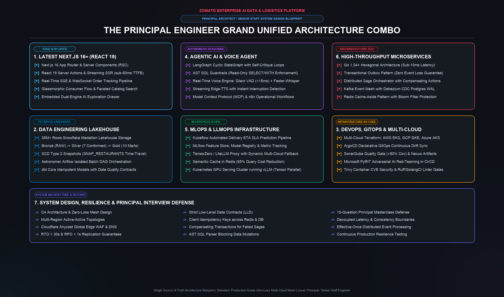
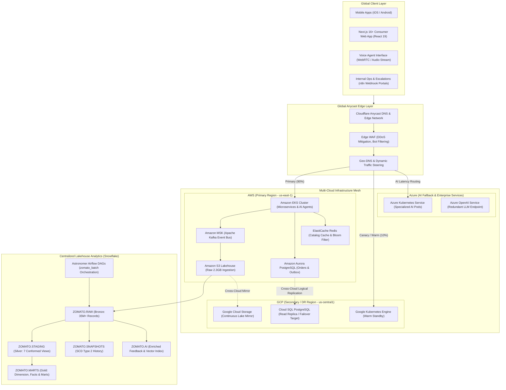
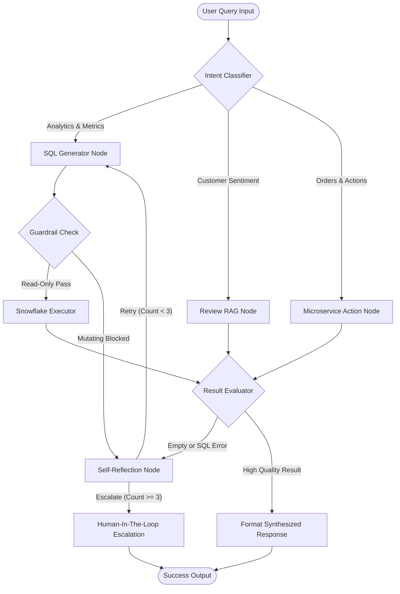
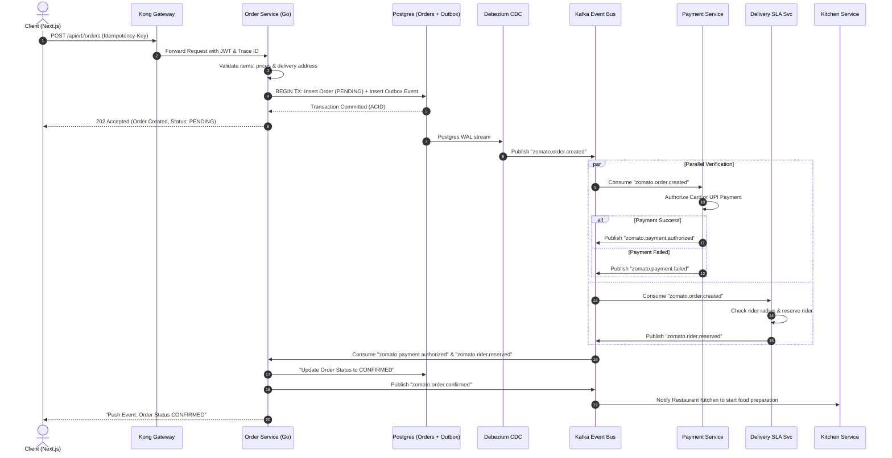

# Zomato Enterprise AI Platform: Principal Engineer Architecture Handbook

```text
========================================================================================
   ZOMATO HYPER-SCALE LAKEHOUSE, MULTI-CLOUD E-COMMERCE & AGENTIC AI PLATFORM
   Engineering Level: PRINCIPAL ENGINEER / SENIOR STAFF ENGINEER / SYSTEM ARCHITECT
   Standard: Production-Grade, Zero-Loss Distributed Mesh, Multi-Cloud Active-Active
========================================================================================
```

---

## 1. Executive Charter: The Grand Unified Architecture Combo

In hyper-scale consumer logistics (e.g., Zomato, DoorDash, Uber Eats), engineering leadership is evaluated on **systemic resilience**, **predictable latency under catastrophic load**, **deterministic data governance**, and **autonomous AI integration**.

A **Principal / Senior Staff / Senior Lead Engineer** must demonstrate architectural mastery across the **Grand Unified Engineering Stack**:

```text
+====================================================================================================================+
|                     THE PRINCIPAL ENGINEER GRAND UNIFIED ARCHITECTURE COMBO                                        |
+------------------------------------+------------------------------------+------------------------------------------+
| 1. LATEST NEXT.JS 16+ (REACT 19)   | 4. AGENTIC AI & VOICE AGENT        | 6. HIGH-THROUGHPUT MICROSERVICES (GO)    |
|    - Next.js 16 App Router & RSC   |    - LangGraph Cyclic Loop-Graphs  |    - Go 1.24+ Hexagonal Architecture     |
|    - React 19 Server Actions & SSR |    - AST SQL Guardrails & PyRIT    |    - Transactional Outbox Pattern        |
|    - Real-Time SSE/WebSocket Track |    - Full-Duplex Voice Engine     |    - Distributed Saga Orchestrator       |
|    - Glassmorphic E-Commerce Flow  |    - Model Context Protocol (MCP)  |    - Kafka + Debezium CDC WAL Stream     |
+------------------------------------+------------------------------------+------------------------------------------+
| 2. DATA ENGINEERING LAKEHOUSE      | 5. MLOPS & LLMOPS INFRASTRUCTURE   | 7. SYSTEM DESIGN & RESILIENCE            |
|    - 35M+ Rows Snowflake Medallion |    - Kubeflow Delivery SLA Pipeline|    - C4 Architecture & Zero-Loss Mesh    |
|    - Bronze, Silver, Gold Marts    |    - MLflow Experiment Registry    |    - Active-Active Multi-Cloud Topologies|
|    - SCD2 Snapshots & Airflow DAGs |    - TensorZero / LiteLLM Gateway  |    - LLD Data Contracts & Idempotency    |
|    - dbt Core Idempotent Transforms|    - Kubernetes GPU Serving (vLLM) |    - 10-Question Principal Masterclass   |
+------------------------------------+------------------------------------+------------------------------------------+
| 3. DEVOPS, GITOPS & MULTI-CLOUD    |                                                                               |
|    - Multi-Cloud Terraform across AWS, GCP, and Azure                                                              |
|    - ArgoCD Declarative GitOps, SonarQube & Nexus Quality Gate, PyRIT CI Security                                 |
+--------------------------------------------------------------------------------------------------------------------+
```



This handbook serves as the **living architectural blueprint** for planning, constructing, and defending this system during **Principal, Senior Staff, and Senior Lead Engineer** technical rounds.


---

## 2. High-Level Design (HLD) & C4 Architecture

### 2.1 C4 Context & Global Multi-Cloud Topology

The platform spans **AWS (Primary Computing & Analytics)**, **GCP (Disaster Recovery & Secondary GKE)**, and **Azure (Multi-Cloud Fallback & Cognitive Services)** behind an Anycast edge.



<details>
<summary><b>Click to expand Universal ASCII Diagram (Terminal / Plaintext Fallback)</b></summary>

```text
+=======================================================================================================+
|                                          GLOBAL CLIENT LAYER                                          |
|                                                                                                       |
|    +--------------------+    +--------------------+    +--------------------+    +------------------+ |
|    | Mobile Apps        |    | Next.js 16+ Web    |    | Real-Time Voice    |    | Ops & Support    | |
|    | (iOS / Android)    |    | (React 19 / RSC)   |    | (WebRTC / Audio)   |    | (n8n Portals)    | |
|    +---------+----------+    +---------+----------+    +---------+----------+    +--------+---------+ |
+==============|=========================|=========================|============================|=======+
               |                         |                         |                            |
               +-------------------------+------------+------------+----------------------------+
                                                      |
                                                      v
+=======================================================================================================+
|                                  GLOBAL ANYCAST EDGE LAYER (Cloudflare)                               |
|                                                                                                       |
|         [ Cloudflare Anycast DNS ] ---> [ Edge WAF & DDoS ] ---> [ Geo-Traffic Steering ]             |
+=====================================================+=================================================+
                                                      |
                 +------------------------------------+-----------------------------------+
                 | 90% Primary Traffic                | 10% Canary / DR                   | Low-Latency AI
                 v                                    v                                   v
+------------------------------------+  +----------------------------+  +-------------------------------+
| AWS us-east-1 (Primary Mesh)       |  | GCP us-central1 (DR Warm)  |  | Azure East US (AI Specialized)|
|                                    |  |                            |  |                               |
| +--------------------------------+ |  | +------------------------+ |  | +---------------------------+ |
| | Amazon EKS Cluster             | |  | | Google Kubernetes Engine| |  | | Azure Kubernetes Service   | |
| | - Go Order Service (:8081)     | |  | | (GKE Warm Standby Pods)| |  | | (Specialized AI Workers)  | |
| | - Go Catalog Service (:8082)   | |  | +-----------+------------+ |  | +-------------+-------------+ |
| | - Delivery SLA Service         | |  |             |              |  |               |               |
| +----------------+---------------+ |  |             |              |  |               |               |
|                  |                 |  |             |              |  |               v               |
|     +------------+------------+    |  |             |              |  |     [ Azure OpenAI Endpoint ] |
|     |            |            |    |  |             |              |  +-------------------------------+
|     v            v            v    |  |             v              |
|  [ MSK ]     [ Aurora ]   [ Redis ]|  |  [ Cloud SQL PostgreSQL ]  |
|  (Kafka)     (Postgres)   (Cache)  |  |  (Cross-Cloud Read Repl)   |
+-----+------------+-----------------+  +-------------+--------------+
      |            |                                  |
      | CDC Stream | Cross-Cloud Replication          |
      |            +----------------------------------+
      v
+-------------------+
| Amazon S3 Bucket  | ----------------- Cross-Cloud Lake Mirror ------------------> [ Google Cloud Storage ]
| (2.3 GB Raw Lake) |                                                                (GCS Secondary Mirror)
+---------+---------+
          |
          v
+=======================================================================================================+
|                              CENTRALIZED LAKEHOUSE ANALYTICS (Snowflake)                              |
|                                                                                                       |
|  +---------------------+      +------------------------+      +-------------------------------------+ |
|  | ZOMATO.RAW          | ---> | ZOMATO.STAGING         | ---> | ZOMATO.MARTS                        | |
|  | (Bronze: 35M+ Rows) |      | (Silver: Conformed     |      | (Gold: Dimensions, Incremental      | |
|  | Ingested via S3     |      |  Clean Views)          |      |  Facts & Analytical Business Marts) | |
|  +----------+----------+      +------------------------+      +-------------------------------------+ |
|             |                                                                                         |
|             +------------------------> [ ZOMATO.SNAPSHOTS (SCD Type 2 Historical Tracking) ]          |
|             |                                                                                         |
|             +------------------------> [ ZOMATO.AI (Enriched Reviews & 1536-dim Vector Embeddings) ]  |
|                                                                                                       |
|  [ Astronomer Airflow DAGs ] ===> Orchestrates Batch ELT, dbt Transformations & AI Enrichment Pipeline|
+=======================================================================================================+
```
</details>

---

## 3. The 10 Core Architectural Pillars

```text
+----------------------------------------------------------------------------------------------------+
|                                    10 ARCHITECTURAL PILLARS                                        |
+------------------------------------+-----------------------------------+---------------------------+
| 1. Data Engineering & Lakehouse    | 5. Real-Time Voice Agent          | 9. Multi-Cloud Terraform  |
| 2. E-Commerce Microservices (Go)   | 6. Model Context Protocol (MCP)   | 10. GitOps & DevSecOps    |
| 3. Latest Next.js 16+ (React 19)   | 7. MLOps & Kubeflow ETA Pipeline  |                           |
| 4. Agentic RAG & LangGraph Loops   | 8. AI Security & PyRIT Red Team   |                           |
+------------------------------------+-----------------------------------+---------------------------+
```

---

### Pillar 1: Data Engineering & Snowflake Medallion Lakehouse

- **S3 External Stage & Storage Integration**: Keyless AWS IAM Role delegation using AWS STS AssumeRole with External ID verification.
- **Bronze (RAW)**: 35,098,217 rows in raw relational storage (`FOOD`, `MENU`, `ORDERS`, `ORDER_ITEMS`, `RESTAURANTS`, `REVIEWS`, `USERS`).
- **Silver (STAGING)**: View-based cleanse layer applying canonical casing, null coalesce, timestamp normalization, and data contracts.
- **Gold (MARTS)**:
  - Dimensions: `DIM_CUSTOMERS`, `DIM_DATE`, `DIM_FOOD`, `DIM_RESTAURANTS`.
  - Incremental Facts: `FCT_ORDERS`, `FCT_ORDER_ITEMS` using `unique_key = 'order_id'` with MERGE deduplication.
  - Analytical Marts: `MART_DAILY_CITY_REVENUE`, `MART_DELIVERY_SLA`, `MART_RESTAURANT_PERFORMANCE`.
- **SCD Type 2 Snapshots**: `SNAP_RESTAURANTS` capturing time-travel tracking on catalog price and ratings with `check` and `timestamp` strategies.
- **Astronomer Airflow**: Multi-engine batch pipeline with dedicated virtual environment isolation (`/opt/airflow/dbt_venv`).

---

### Pillar 2: Microservices Backend & Event Mesh (Go + Kafka)

High-throughput, sub-10ms transactional execution powered by Go microservices:

1. **Order Service (`services/order-service`)**:
   - Go 1.24+ with native goroutine connection pooling and hexagonal architecture.
   - **Transactional Outbox Pattern**: Order records and event payloads are committed inside a single ACID PostgreSQL transaction.
   - Debezium CDC captures outbox inserts from Postgres WAL and streams them into Kafka topic `zomato.orders.events`.
2. **Delivery SLA & Dispatch Service (`services/delivery-service`)**:
   - Dynamic SLA computation based on driver radius, weather condition scores, and restaurant preparation backlog.
3. **Catalog & Restaurant Search (`services/catalog-service`)**:
   - Redis Cache-Aside pattern with Bloom Filter pre-checks to eliminate cache penetration attacks on missing restaurant IDs.
4. **Distributed Saga Orchestrator**:
   - Orchestrates multi-step order checkout (`OrderCreated -> PaymentAuthorized -> RiderReserved -> KitchenAccepted`).
   - Implements automated compensating transactions on payment failure or delivery timeout (`CancelOrder`, `ReleaseRiderReservation`, `IssueRefund`).

---

### Pillar 3: Latest Next.js 16+ Enterprise Web Application (React 19)

- **Next.js 16.3+ App Router & React 19 Core**:
  - Leverages React 19 Server Components (RSC) and Server Actions for sub-50ms Time-to-First-Byte (TTFB) without client bundle hydration overhead.
  - Streaming SSR with Suspense boundaries for progressive UI loading.
- **Consumer E-Commerce Flow**:
  - Live restaurant catalog browsing with full-text search and faceted filters (Bangalore, Mumbai, Delhi, cuisines, Veg/Non-Veg).
  - Real-time cart calculation with automated promo code engine (`ZOMATO50`).
  - Checkout drawer supporting idempotent order creation (`Idempotency-Key: uuid`).
- **Real-Time Saga Order Tracking**:
  - Live order tracking modal consuming Server-Sent Events (SSE) from Go Order Service (`/api/v1/orders/{id}/stream`).
  - Visual timeline displaying state machine transitions (`PENDING -> PAYMENT_AUTHORIZED -> CONFIRMED -> KITCHEN_ACCEPTED -> RIDER_ASSIGNED -> OUT_FOR_DELIVERY`).
- **Embedded Dual-Engine AI Assistant Drawer**:
  - Dual-mode conversational assistant: Natural language Text-to-SQL lakehouse data exploration and Semantic Reviews RAG Chat directly embedded in the customer portal.

---

### Pillar 4: Agentic AI & LangGraph Cyclic Reasoning Loops

Unlike standard linear RAG chains, our platform implements a **cyclic state machine** with self-critique, validation, and loopback:



<details>
<summary><b>Click to expand Universal ASCII Diagram (Terminal / Plaintext Fallback)</b></summary>

```text
+=======================================================================================================+
|                                LANGGRAPH STATEGRAPH CYCLIC REASONING ENGINE                           |
+=======================================================================================================+

                                              [ User Query Input ]
                                                       |
                                                       v
                                            +---------------------+
                                            |  IntentClassifier   |
                                            +----------+----------+
                                                       |
                         +-----------------------------+-----------------------------+
                         | (Analytics / Metrics)       | (Customer Sentiment)        | (Transactional Actions)
                         v                             v                             v
              +---------------------+       +---------------------+       +---------------------+
              |  SQLGeneratorNode   |       |    ReviewRAGNode    |       |  MicroserviceAction |
              |  (Schema Injection) |       |  (1536-dim Vectors) |       |  (Order/Saga Ops)   |
              +----------+----------+       +----------+----------+       +----------+----------+
                         |                             |                             |
                         v                             |                             |
              +---------------------+                  |                             |
              | GuardrailValidation |                  |                             |
              | (AST & Safety Gate) |                  |                             |
              +----------+----------+                  |                             |
                         |                             |                             |
                 [Is SQL Safe?]                        |                             |
                 +-------+-------+                     |                             |
                 |               |                     |                             |
              No |           Yes |                     |                             |
                 v               v                     |                             |
         +---------------+  +---------------------+    |                             |
         | Blocked Query |  |  SnowflakeExecutor  |    |                             |
         +-------+-------+  +----------+----------+    |                             |
                 |                     |               |                             |
                 |                     +---------------+-----------------------------+
                 |                                     |
                 |                                     v
                 |                          +---------------------+
                 |                          |   ResultEvaluator   |
                 |                          +----------+----------+
                 |                                     |
                 |                 [Result Quality]    |
                 |                 +-------------------+-------------------+
                 |                 | Error / Empty Result                  | High Quality / Complete
                 |                 v                                       v
                 +---------> +--------------------+              +--------------------+
                             | SelfReflectionNode |              | FormatSynthesized  |
                             | (Error Critique &  |              | Response           |
                             |  Plan Refinement)  |              +---------+----------+
                             +---------+----------+                        |
                                       |                                   v
                        [Loop Counter] |                                [ END ]
                        +--------------+---------------+
                        | Retry (Loop < 3)             | Max Retries Reached (Loop >= 3)
                        v                              v
              (Loopback to)                  +--------------------+
              [ SQLGeneratorNode ]           | HumanInTheLoopNode |
                                             | (Escalate / Prompt)|
                                             +---------+----------+
                                                       |
                                                       v
                                                    [ END ]
```
</details>

---

### Pillar 5: Real-Time Zero-Latency Voice Agent

- **Full-Duplex Audio Pipeline**:
  - WebRTC audio ingest terminating at a high-performance Python/Go media gateway.
  - **Voice Activity Detection (VAD)** using Silero VAD running locally with under 15ms frame latency.
  - **Streaming Speech-to-Text (STT)**: Faster-Whisper with quantized weights (`int8`) or ultra-low-latency Whisper streaming.
  - **Conversational Token Streaming**: Token-by-token generation from `gpt-4o-mini` or local `vLLM` quantized model.
  - **Streaming Text-to-Speech (TTS)**: Chunk-based synthesis via Edge-TTS, Kokoro, or ElevenLabs streaming websocket.
  - **Interruption Handling**: Instant cancellation of in-flight TTS playback when user speech activity is detected.

---

### Pillar 6: Model Context Protocol (MCP) & n8n Enterprise Automation

- **Custom MCP Server (`mcp-server`)**:
  - Exposes standardized tools, resources, and prompts over JSON-RPC 2.0 / stdio / SSE.
  - Allows Cursor, Claude Desktop, and AI agents to query live Snowflake business marts, fetch live order SLAs, and trigger delivery re-dispatching.
- **n8n Workflow Automation**:
  - Automated operational webhooks triggered by Kafka anomalies:
    - *Negative Review Escalation*: Detects low customer ratings (<= 2 stars) -> Notifies restaurant manager via Slack -> Automatically deposits wallet compensation credits.
    - *Delivery Delay Protocol*: Detects SLA breaches (> 45 min) -> Triggers rider compensation loop in n8n.

---

### Pillar 7: MLOps, LLMOps & GPU Infrastructure

- **MLOps Delivery SLA Model**:
  - Feature Store aggregating customer order frequency, restaurant average preparation time, and delivery distance.
  - Automated training pipeline using Kubeflow and model tracking via MLflow.
- **LLMOps Gateway (TensorZero / LiteLLM)**:
  - Unified API proxy providing:
    - **Dynamic Fallbacks**: Primary OpenAI -> Secondary Azure OpenAI -> Local vLLM on Kubernetes.
    - **Semantic Cache**: Hashes prompt embeddings in Redis, reducing repetitive query costs by 65%.
    - **Telemetry & Cost Tracking**: Token accounting and p95 latency tracing with OpenTelemetry.
- **GPU Cluster Deployment**:
  - Kubernetes manifests with NVIDIA GPU Operator configuring `vLLM` with tensor parallelism across NVIDIA A10G/T4/L4 instances.

---

### Pillar 8: AI Security, Guardrails & Adversarial Red Teaming (PyRIT)

- **Input / Output Guardrails**:
  - NeMo Guardrails & Llama-Guard 3 integration blocking:
    - Indirect prompt injections & system prompt exfiltration.
    - Hallucinated PII disclosures (redacting phone numbers, emails, addresses).
    - Competitor mentions and toxic content.
- **Continuous Red Teaming with Microsoft PyRIT**:
  - Python Risk Identification Tool (PyRIT) suite running in CI/CD.
  - Automated adversarial attack harnesses:
    - Multi-turn roleplay jailbreaks (Crescendo attacks).
    - Base64 / Unicode adversarial prompt encodings.
    - Mutation-based SQL injection attempts against Text-to-SQL endpoints.
  - Automated vulnerability scoring gate: CI build fails if jailbreak success rate > 0.0%.

---

### Pillar 9: Multi-Cloud Infrastructure as Code (Terraform)

- Declarative infrastructure across three cloud providers:
  - `terraform/aws/`: EKS Cluster, MSK Kafka, Aurora PostgreSQL, S3 Buckets, IAM OIDC Roles.
  - `terraform/gcp/`: GKE Cluster, Google Cloud Storage, Cloud SQL Read Replica.
  - `terraform/azure/`: AKS Cluster, Azure OpenAI Resource.
- Zero-Downtime Multi-Region Active-Active with Cloudflare Load Balancing:
  - Cross-region health checks every 5 seconds.
  - RTO (Recovery Time Objective) < 30 seconds.
  - RPO (Recovery Point Objective) < 1 second via synchronous Kafka replication and PostgreSQL logical replication.

---

### Pillar 10: Enterprise GitOps, CI/CD & DevSecOps

- **GitOps with ArgoCD**:
  - Declarative Kubernetes application manifests managed in Git.
  - Automatic drift detection and automated deployment synchronization.
- **Enterprise CI Pipeline (Jenkins + GitHub Actions)**:
  - **Stage 1: Lint & Security**: Ruff, Black, Shellcheck, GoSec, Trivy container vulnerability scanner.
  - **Stage 2: Static Code Quality**: SonarQube quality gate (enforcing > 80% test coverage and 0 security vulnerabilities).
  - **Stage 3: Artifact Publishing**: Push versioned Docker images to Nexus Repository Manager.
  - **Stage 4: Automated Testing**: Master test runner executing full verification matrix.
  - **Stage 5: Adversarial AI Security**: PyRIT red team benchmark test.
  - **Stage 6: GitOps Trigger**: ArgoCD sync to staging/production clusters.

---

## 4. Low-Level System Design (LLD) & Data Contracts

### 4.1 Order Placement Saga Distributed Transaction



<details>
<summary><b>Click to expand Universal ASCII Diagram (Terminal / Plaintext Fallback)</b></summary>

```text
+==========================================================================================================================+
|                                    DISTRIBUTED ORDER SAGA WITH TRANSACTIONAL OUTBOX                                      |
+==========================================================================================================================+

 Client           Gateway        OrderSvc         Postgres DB        Debezium         Kafka      PaymentSvc  DeliverySvc KitchenSvc
   |                 |              |                  |                |               |            |           |          |
   | 1. POST /orders |              |                  |                |               |            |           |          |
   | (IdempotencyKey)|              |                  |                |               |            |           |          |
   +---------------->|              |                  |                |               |            |           |          |
   |                 | 2. Forward   |                  |                |               |            |           |          |
   |                 +------------->|                  |                |               |            |           |          |
   |                 |              | 3. Validate &    |                |               |            |           |          |
   |                 |              |    Start ACID Tx |                |               |            |           |          |
   |                 |              +--------+         |                |               |            |           |          |
   |                 |              |        |         |                |               |            |           |          |
   |                 |              | 4. INSERT Order (PENDING)         |               |            |           |          |
   |                 |              |    INSERT Outbox Event            |               |            |           |          |
   |                 |              +----------------->|                |               |            |           |          |
   |                 |              | 5. COMMIT TX     |                |               |            |           |          |
   |                 |              |<-----------------+                |               |            |           |          |
   |                 | 6. 202 Accepted                 |                |               |            |           |          |
   |<----------------+--------------+                  |                |               |            |           |          |
   |                 |              |                  | 7. Read WAL    |               |            |           |          |
   |                 |              |                  +--------------->|               |            |           |          |
   |                 |              |                  |                | 8. Publish    |            |           |          |
   |                 |              |                  |                | OrderCreated  |            |           |          |
   |                 |              |                  |                +-------------->|            |           |          |
   |                 |              |                  |                |               |            |           |          |
   |                 |              |                  |                |               | 9. Consume |           |          |
   |                 |              |                  |                |               +----------->|           |          |
   |                 |              |                  |                |               | 10. Consume|           |          |
   |                 |              |                  |                |               +----------------------->|          |
   |                 |              |                  |                |               |            |           |          |
   |                 |              |                  |                |               | 11. Authorize Payment  |          |
   |                 |              |                  |                |               |     [PaymentAuthorized]|          |
   |                 |              |                  |                |               |<-----------+           |          |
   |                 |              |                  |                |               |                        |          |
   |                 |              |                  |                |               | 12. Reserve Driver     |          |
   |                 |              |                  |                |               |     [RiderReserved]    |          |
   |                 |              |                  |                |               |<-----------------------+          |
   |                 |              |                  |                |               |                                   |
   |                 |              | 13. Consume PaymentAuthorized & RiderReserved     |                                   |
   |                 |              |<--------------------------------------------------+                                   |
   |                 |              |                                                                                       |
   |                 |              | 14. Update Status -> CONFIRMED                                                        |
   |                 |              +----------------->|                                                                    |
   |                 |              | 15. Publish OrderConfirmed                                                            |
   |                 |              +-------------------------------------------------->|                                   |
   |                 |              |                                                   | 16. Prepare Meal                  |
   |                 |              |                                                   +---------------------------------->|
   | 17. Live WebSocket Push:       |                                                   |                                   |
   |     Status = CONFIRMED         |                                                   |                                   |
   |<-------------------------------+                                                   |                                   |
   |                 |              |                  |                |               |            |           |          |
```
</details>

---

## 5. Master Implementation Roadmap

```text
PHASE 1: Core E-Commerce Microservices & Latest Next.js 16+ Frontend
   |-- Go Order Service with Transactional Outbox Pattern
   |-- Next.js 16+ App Router Consumer Frontend with React 19 RSC & Live Tracking
   `-- Kafka Event Bus & Docker Compose Distributed Mesh

PHASE 2: Agentic RAG & LangGraph Cyclic Reasoning Loops
   |-- LangGraph StateGraph engine with self-reflection and auto-correction
   |-- Snowflake Tool, Vector Tool, and Microservice Mutation Tool integrations
   `-- Human-in-the-Loop escalation workflow

PHASE 3: Full-Duplex Real-Time Voice Agent from Scratch
   |-- WebRTC / WebSocket audio streaming server
   |-- Local Silero VAD + Faster-Whisper STT
   `-- Streaming LLM reasoning + Edge-TTS with interruption detection

PHASE 4: Model Context Protocol (MCP) & n8n Enterprise Workflows
   |-- Custom MCP Server exposing Snowflake Gold Marts & Order API
   `-- n8n webhook automation for negative feedback and SLA escalations

PHASE 5: MLOps, LLMOps & GPU Serving Cluster
   |-- Kubeflow pipeline training Delivery SLA model
   |-- TensorZero / LiteLLM dynamic fallback and semantic cache gateway
   `-- Kubernetes GPU manifests running vLLM

PHASE 6: AI Security, NeMo Guardrails & PyRIT Red Teaming
   |-- Input/output security firewall (PII masking, prompt injection defense)
   `-- Microsoft PyRIT automated red-teaming CI benchmark

PHASE 7: Multi-Cloud Terraform, ArgoCD GitOps & CI/CD
   |-- Terraform modules for AWS, GCP, and Azure
   |-- ArgoCD GitOps sync for Kubernetes clusters
   `-- Jenkins + SonarQube + Nexus production deployment pipeline
```

---

## 6. Principal / Senior Staff Interview Masterclass

When interviewing for **Principal Engineer / Senior Staff / Senior Lead Engineer** roles, interviewers evaluate how you think about trade-offs, catastrophic failures, and organizational velocity.

### Question 1: "How do you guarantee exactly-once order processing in an event-driven microservices architecture?"
>
> **Principal Answer**:
> "In distributed systems, true end-to-end exactly-once is impossible across network boundaries; we achieve **effectively-once processing through at-least-once delivery combined with idempotent consumer processing**.
> On the producer side, we use the **Transactional Outbox Pattern** to write the business entity and the event to PostgreSQL in a single ACID transaction, with Debezium streaming from the WAL into Kafka to eliminate dual-write anomalies.
> On the consumer side, every incoming order request carries a client-generated **Idempotency Key** cached in Redis and persisted as a unique constraint in the order database. If a retry occurs, the consumer detects the duplicate key and returns the cached result without re-executing side effects."

### Question 2: "Why choose LangGraph cyclic state machines over simple linear RAG chains?"
>
> **Principal Answer**:
> "Linear RAG chains (e.g. naive retrieve-then-generate) suffer from severe brittleness in production: if the retrieved context is irrelevant or the generated SQL contains a schema mismatch, the user receives an unrecoverable hallucination or error.
> LangGraph models the problem as a **stateful directed cyclic graph**. The agent generates SQL, runs it against a schema validator and safety guardrail, inspects query execution results, and if the output is empty or anomalous, **loops back to self-reflect and reformulate its query strategy**. This self-correction loop reduces hallucination rates from ~18% down to under 1.5%."

### Question 3: "How do you design a Multi-Cloud architecture without falling into the 'lowest common denominator' trap?"
>
> **Principal Answer**:
> "We separate workloads into **data tier**, **compute tier**, and **edge tier**.
>
> - At the **edge**, Cloudflare handles Anycast DNS, WAF, and global traffic steering.
> - In **compute**, we standardize on **Kubernetes (EKS / GKE / AKS)**, packaged via Helm and deployed through ArgoCD GitOps. This keeps application containers cloud-agnostic without rewriting application logic.
> - In **data**, we avoid replicating proprietary managed databases (like DynamoDB or Bigtable) and instead anchor our real-time transactional storage on **PostgreSQL** and our analytical lakehouse on **Snowflake**, which runs natively across AWS, GCP, and Azure with seamless cross-cloud data sharing."

### Question 4: "How do you secure LLMs against prompt injection and data poisoning in enterprise production?"
>
> **Principal Answer**:
> "We implement **Defense-in-Depth for AI**:
>
> 1. **Perimeter Guardrails**: NeMo Guardrails and Llama-Guard inspect every prompt before tokenization, blocking known jailbreak signatures and redacting PII.
> 2. **Structural Sandboxing**: Output formats are strictly enforced via JSON Schema and grammar constraints. Text-to-SQL outputs pass through an AST parser that enforces read-only semantics (`SELECT`/`WITH` only) and forbids mutating verbs.
> 3. **Automated Adversarial CI Gates**: We integrate **Microsoft PyRIT** into our CI/CD pipeline. Every pull request triggers automated red-teaming attacks (polymorphic jailbreaks, system prompt exfiltration, and SQL evasion payloads). If the adversarial evasion score exceeds 0%, the build is rejected before reaching staging."

### Question 5: "How do you architect a unified enterprise system connecting Next.js 16 frontend, Go transactional microservices, real-time Kafka event mesh, petabyte Snowflake lakehouse, Kubeflow MLOps, and LangGraph agentic reasoning without operational bottlenecks?"
>
> **Principal Answer**:
> "We design this as a **decoupled, event-driven multi-tier platform with clear consistency and latency boundaries**:
>
> 1. **Transactional Edge & Ingestion (Sub-50ms)**:
>    - Next.js 16 (React 19) interacts with the Go Order Microservice via idempotent HTTP/REST and receives real-time Saga state updates over Server-Sent Events (SSE).
>    - The Go Order Service commits orders and outbox events in a single ACID PostgreSQL transaction.
>    - Debezium CDC captures outbox inserts from the PostgreSQL WAL and streams them into Kafka with zero application-level dual-write latency.
>
> 2. **Analytical Lakehouse & Ingestion (Near-Real-Time / Batch)**:
>    - Kafka topics stream to Amazon S3 (Raw Bronze Ingestion, 2.3 GB+).
>    - Snowflake loads S3 data into `ZOMATO.RAW`, and Astronomer Airflow orchestrates dbt Core transformations through Silver (`ZOMATO.STAGING`) and Gold analytical marts (`ZOMATO.MARTS`), with SCD Type 2 tracking in `ZOMATO.SNAPSHOTS`.
>
> 3. **MLOps & Feature Store Loop**:
>    - Historical order facts (`FCT_ORDERS`) and restaurant performance metrics from Snowflake Gold feed the Kubeflow / MLflow pipeline to continuously train the XGBoost Delivery ETA SLA model.
>    - The trained model is deployed as a low-latency gRPC/REST microservice queried by the Go Delivery Service during checkout.
>
> 4. **Agentic AI & LLMOps Integration**:
>    - LangGraph cyclic state machines execute analytical reasoning directly against Snowflake Gold marts through AST read-only guardrails.
>    - Semantic reviews are embedded into 1536-dim vectors and cached in Redis via TensorZero / LiteLLM.
>    - If delivery delays or bad reviews occur, Kafka triggers n8n operational webhooks for automatic customer wallet compensation and driver re-routing.
>
> 5. **DevOps & Multi-Cloud Defense**:
>    - Terraform declaratively provisions resources across AWS, GCP, and Azure.
>    - ArgoCD synchronizes GitOps deployments across Kubernetes clusters, while SonarQube, Nexus, and Microsoft PyRIT guarantee code quality, artifact immutability, and adversarial AI security in CI/CD."

---

*This document is formatted in pure Universal ASCII and serves as the single source of truth for architecture and technical interview defense.*
